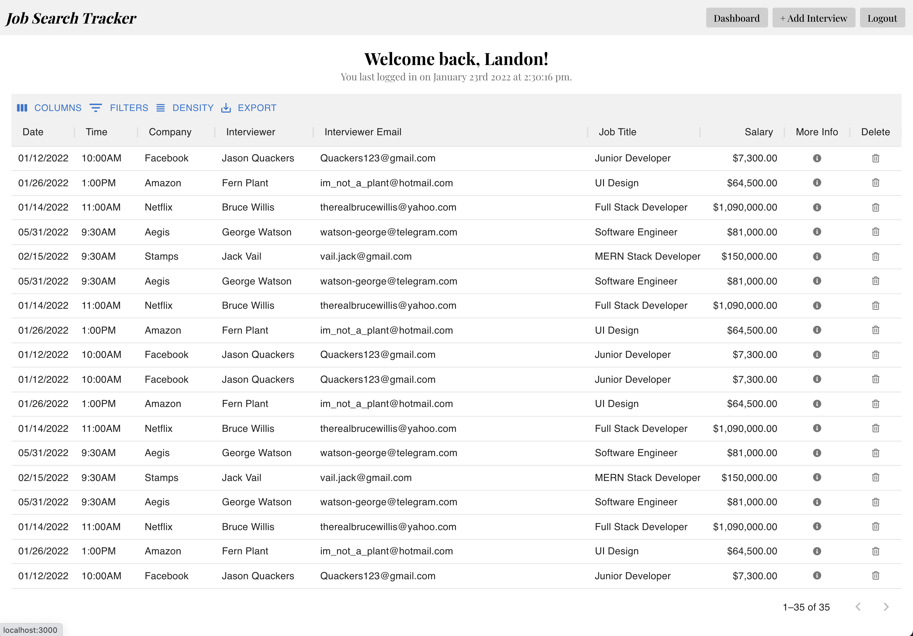
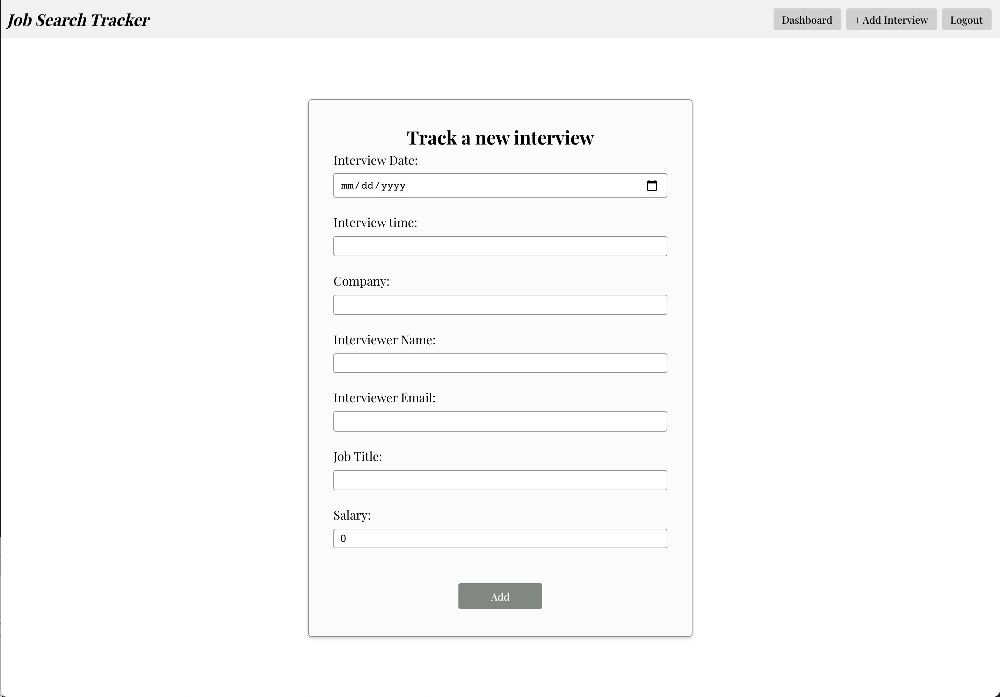
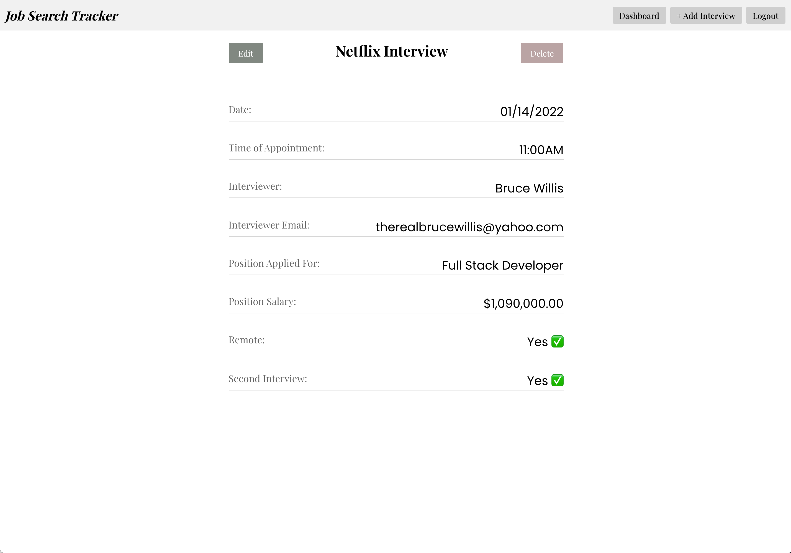
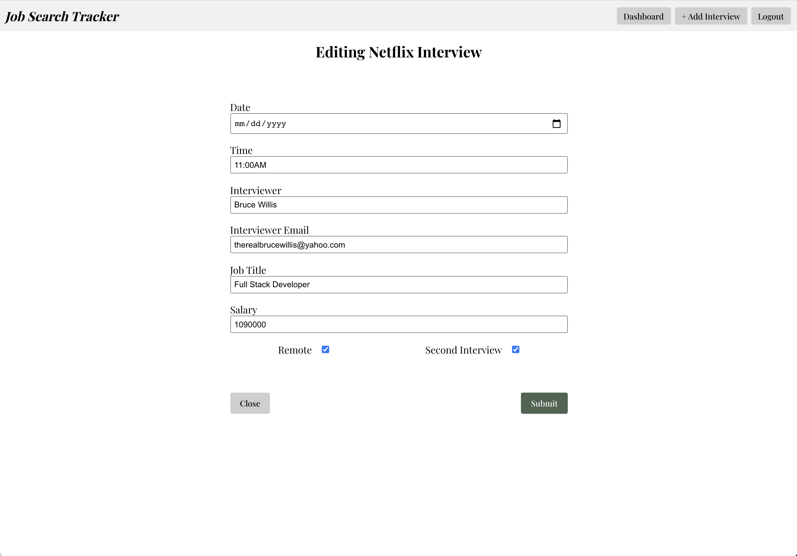

# Job Search Tracker - API

## Project Description

This is the API for Job Search Tracker.
Job Search Tracker lets you keep track of your job search by adding interview dates and info about your applications.

Tagline:

> Track the endless job search, store info about upcoming interviews, and keep your data secure, all in a fresh new design. There's a light at the end of the tunnel. Track your job search. Track your future.

## Technologies Used

This is a MERN stack application.

- React
- React-Router-Dom
- MongoDB
- Express
- Node
- JavaScript
- CSS, flexbox, css:selectors
- HTML

## Installation Instructions

To install this repository:

- If you would like to fork the repository so you have your own copy, feel free to!
- Click on the green "Code" button.
- Copy either the HTTPS or SSH link that is provided (SSH is preferred)
- Open up the Terminal and navigate to the desired directory location
- Once inside, use the code "`git clone` copied_link_here"
- Once the repo has been installed, change into the directory with `cd job-search-mern-api`
- From here you can run `code .` to open it up in VS Code

## Product Images

Landing Page

Dashboard

Add a new interview

Interview Info

Edit Interview

### Unsolved Problems

I have full MERN set up for tracking the interviews/applications, but no current User model to be able to actually 'Login' to see only your information. Learning Passport in order to incorporate individual users.

Still need to fully create the User model and controller